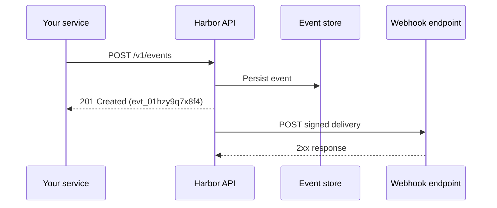

# Event lifecycle

An event is an immutable record of something that happened in a workspace. Harbor persists the event, then asynchronously notifies any webhook endpoints subscribed to that event type.

## Lifecycle overview

Events are write-once. You cannot update or delete an event through the public API. If you need to correct data, emit a compensating event (for example, `invoice.voided` after `invoice.paid`).

## Event anatomy

| Field | Example | Notes |
| ----- | ------- | ----- |
| `id` | `evt_01hzy9q7x8f4` | Stable identifier for retrieval and idempotency |
| `type` | `invoice.paid` | Dot-separated name your consumers subscribe to |
| `workspaceId` | `ws_018f3a2e4b9c` | Isolation boundary for keys and webhooks |
| `payload` | `{ "invoiceId": "inv_..." }` | JSON object, max 256 KB |
| `createdAt` | `2026-05-25T12:00:00Z` | Set by Harbor at creation time |

## Idempotency and duplicates

Network retries can submit the same `POST` twice. Pass an `Idempotency-Key` header (REST) or `idempotencyKey` option (SDK) so Harbor returns the original event instead of creating a duplicate.

Idempotency keys expire after 24 hours. After that window, the same key creates a new event.

## Event replay

Replay is useful when a downstream consumer missed events during an outage. Harbor does not mutate historical events. Instead:

1. List events from a known cursor or timestamp using [Pagination](../guides/pagination).
2. Re-process payloads in your consumer.
3. For webhook-only integrations, use the dashboard **Webhooks → Deliveries → Replay** on a failed delivery.

:::info
Replay from the dashboard re-sends the same signed payload to your endpoint. Your handler should tolerate duplicate deliveries (see [Webhook delivery](./webhook-delivery)).
:::

## Next steps

- [Creating events](../guides/creating-events) with SDK and cURL examples
- [Webhook delivery](./webhook-delivery) for the outbound notification flow
- [Events SDK reference](../sdk-reference/events) for method details
