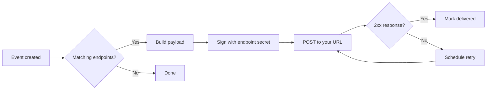

# Webhook delivery

When an event matches a registered endpoint's filter, Harbor sends an HTTPS `POST` to your URL. Deliveries are signed, retried on failure, and logged in the dashboard.

## Delivery flow



Each delivery is independent. If you register three endpoints for `order.shipped`, Harbor sends three requests.

## Delivery payload

Harbor wraps the event in an envelope:

```json
{
  "id": "del_0193f1a2c001",
  "type": "event.created",
  "created_at": "2026-05-25T12:00:01Z",
  "data": {
    "id": "evt_02m4k9p1q7w3",
    "type": "order.shipped",
    "workspace_id": "ws_018f3a2e4b9c",
    "payload": {
      "order_id": "ord_0192be7a3c4f",
      "carrier": "ups"
    },
    "created_at": "2026-05-25T12:00:00Z"
  }
}
```

Use `data.id` for deduplication. The delivery ID (`del_` prefix) identifies a specific attempt sequence, not the underlying event.

## Headers

| Header | Purpose |
| ------ | ------- |
| `Harbor-Signature` | HMAC signature of `{timestamp}.{body}` |
| `Harbor-Timestamp` | Unix timestamp when Harbor signed the payload |
| `Harbor-Delivery-Id` | Unique ID for this delivery attempt |

Verify signatures before parsing JSON. `verifyWebhookSignature()` rejects timestamps older than five minutes. Full handler example in [Webhooks guide](../guides/webhooks).

## Retries and timeouts

Harbor waits up to 10 seconds for a response. Non-`2xx` status codes and connection failures trigger retries with exponential backoff. See the retry schedule in [Webhooks guide § Delivery retries](../guides/webhooks#delivery-retries). Retries stop after **72 hours** total.

Your endpoint must be idempotent: the same event may arrive more than once after retries or manual replay.

## At-least-once semantics

Harbor guarantees **at-least-once** delivery, not exactly-once. Store processed event IDs in your database and skip duplicates:

```typescript
async function handleDelivery(envelope: DeliveryEnvelope) {
  const eventId = envelope.data.id;
  if (await db.processedEvents.has(eventId)) return;
  await processEvent(envelope.data);
  await db.processedEvents.add(eventId);
}
```

## Next steps

Continue to [Webhooks guide](../guides/webhooks). Verification issues in [Common errors](../troubleshooting/common-errors).
