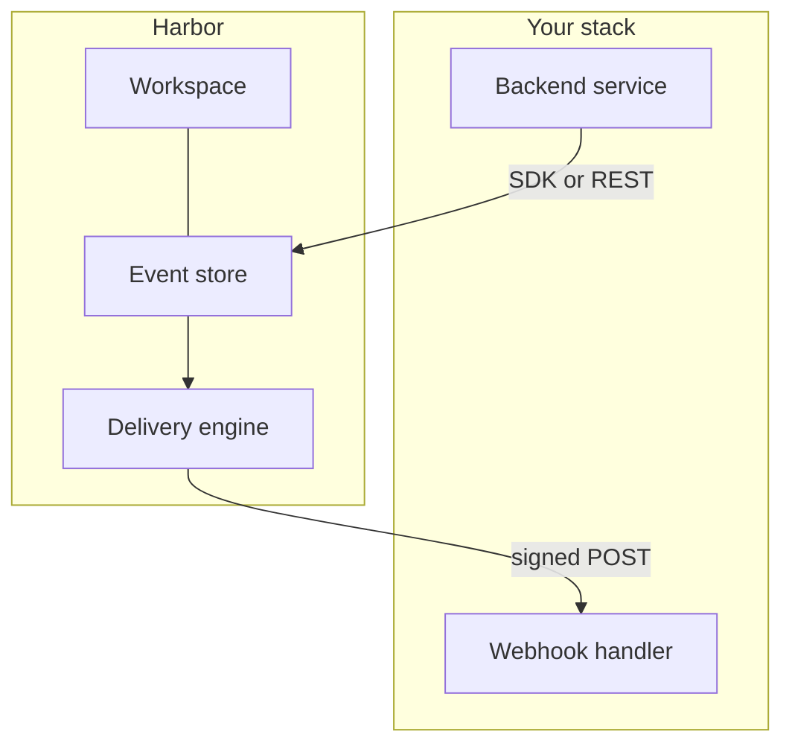

# Harbor SDK

Harbor is an **event routing platform** for **workspaces**, **events**, and **outbound webhooks**. You emit events from your backend, Harbor persists them, and subscribed HTTPS endpoints receive signed deliveries.

The `@harbor/sdk` package wraps the REST API for Node.js with typed clients, cursor pagination, and retry handling.

## Platform overview

| Resource | Purpose |
| -------- | ------- |
| **Workspaces** | Isolation boundary for events, webhooks, and API keys |
| **Events** | Immutable records of activity (for example, `order.shipped`) |
| **Webhooks** | HTTPS endpoints Harbor calls when matching events occur |
| **API keys** | Secret or restricted credentials for server-side access |

Harbor is intentionally narrow: it routes and delivers events. It is not a database, auth provider, or file store.

## How it fits together

Read [Event lifecycle](./concepts/event-lifecycle) and [Webhook delivery](./concepts/webhook-delivery) for the full sequence.

## SDK vs REST API

| Use the SDK when | Use the REST API when |
| ---------------- | --------------------- |
| Building Node.js services with repeated calls | Writing scripts in other languages |
| You need pagination helpers and typed errors | Prototyping with cURL or the dashboard explorer |
| Multiple teams share error handling patterns | Infrastructure probes or one-off admin tasks |

REST conventions are documented in [REST API overview](./rest-api/overview).

## What the SDK includes

- Secret key auth with automatic host selection (`hb_test_` vs `hb_live_`)
- Cursor pagination and `listAuto` for batch exports
- Retries with backoff for rate limits and transient `5xx` responses
- `verifyWebhookSignature()` for inbound delivery validation
- Typed `HarborError` with stable `code` values

## Quick links

| Goal | Start here |
| ---- | ---------- |
| Install and first event | [Installation](./getting-started/installation) → [Quickstart](./getting-started/quickstart) |
| Understand events | [Event lifecycle](./concepts/event-lifecycle) |
| Receive notifications | [Webhooks guide](./guides/webhooks) |
| Production credentials | [Managing API keys](./guides/managing-api-keys) |
| Upgrade from SDK v1 | [Migrating from v1.0](./getting-started/migrating-from-1-0) |
| Debug failures | [Common errors](./troubleshooting/common-errors) |
